# Lernstand-Überprüfungs-Software (LÜS)

## Gliederung
1. [Installationsanweisungen](#1-installationansweisungen)<br />
    1.1 [Voraussetzungen](#11-voraussetzungen)<br />
    1.2 [Installation auf ihrem Gerät](#12-installation-auf-ihrem-gerät)
2. [Benutzung](#2-benutzung)<br />
    2.1 [Server](#21-server)<br />
    2.2 [Client](#22-client)<br />
3. [Entwicklerhinweise](#3-entwicklerhinweise)<br />
    3.1 [Projektstruktur](#31-projektstruktur)<br />
    3.2 [Mögliche Erweiterungen](#32-mögliche-erweiterungen)<br />

<div align="justify"><!-- Bocksatz-->

## 1. Installationansweisungen

### 1.1 Voraussetzungen
- installieren Sie sich die Java SDK Version 24, in dem Sie das Terminal öffnen und folgendes ausführen:

    auf ``Windows:``
    ````
    winget install --id EclipseAdoptium.Temurin.24.JDK -e --accept-package-agreements --accept-source-agreements
    ````

    auf ``Linux:``
    ````
    sudo apt update
    sudo apt install temurin-24-jdk
    ````

    auf ``MacOS:``
    ````
    brew update
    brew install --cask temurin24
    ````

### 1.2 Installation auf ihrem Gerät 
-  **Schritt 1:** Klonen Sie dieses Repositorium auf ihre lokales Gerät:
    
    mit Hilfe von ``Git:`` 
    ````
    git clone https://git.uni-jena.de/fusion/teaching/thesis/projektarbeit-tobias-friedrich-und-felix-staacke/lues
    ````

    ohne Git:

    <video  autoplay muted loop><source src="ttps://git.uni-jena.de/fusion/teaching/thesis/projektarbeit-tobias-friedrich-und-felix-staacke/docu/-/blob/main/modelledWorkflow/cloneRepo.mp4" type="video/mp4">Dein Browser unterstützt das Video nicht</video>


    
- **Schritt 2:** Öffnen Sie den heruntergeladenen Order ``lues``.


## 2. Benutzung
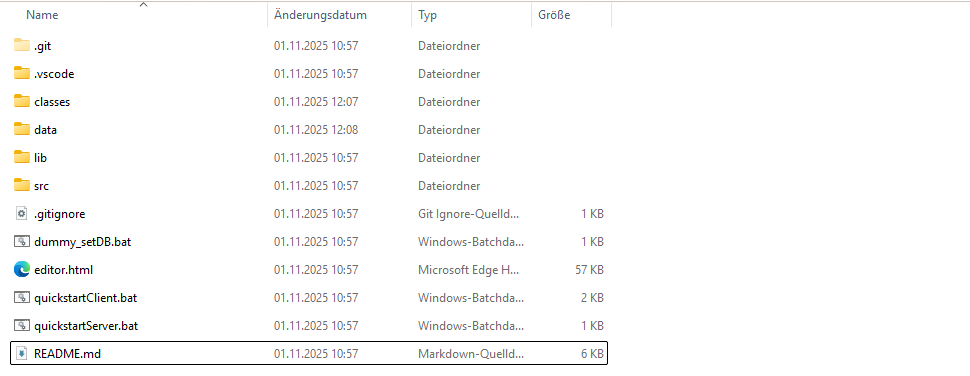
### 2.1 Server

- bevor Sie den Server starten, führen Sie ``dummy_setDB.bat``. Hierdurch wird die Datenbank erstellt und mit dummy-Daten  gefüllt. 
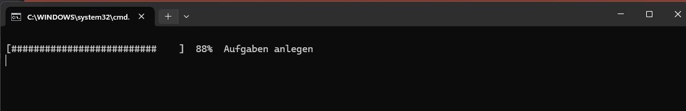
- Danach können Sie ``quickstartServer.bat`` ausführen und den Server mit den Dummy Daten ausführen.
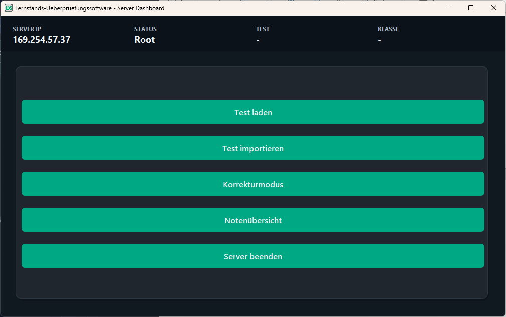

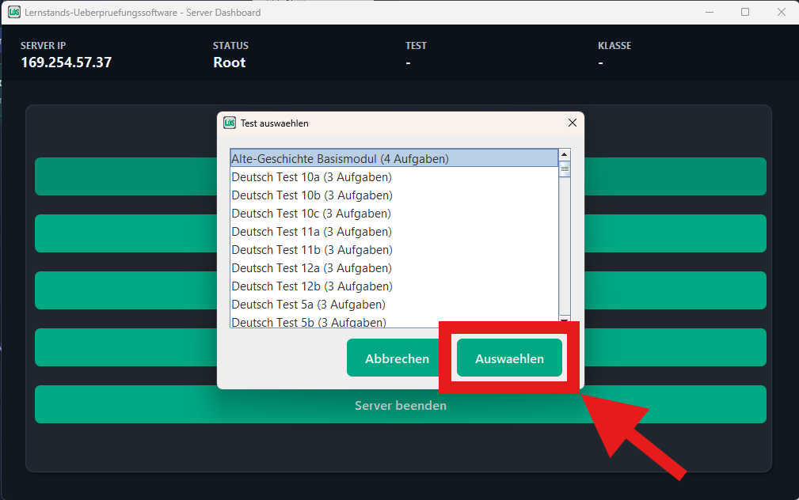
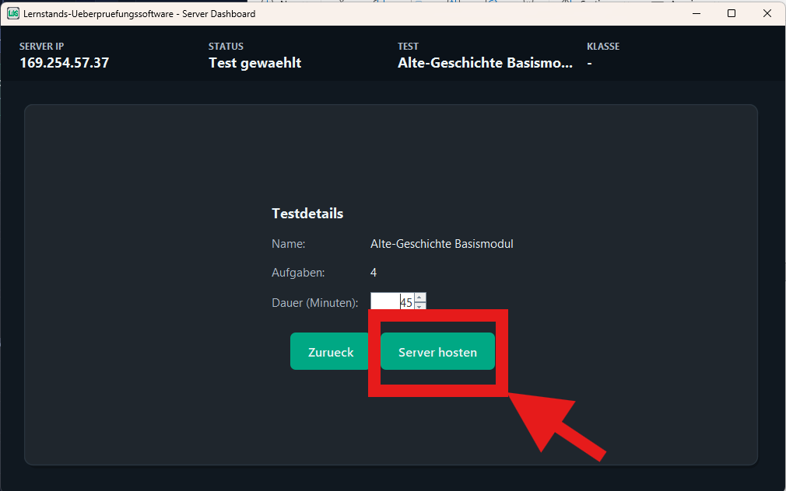
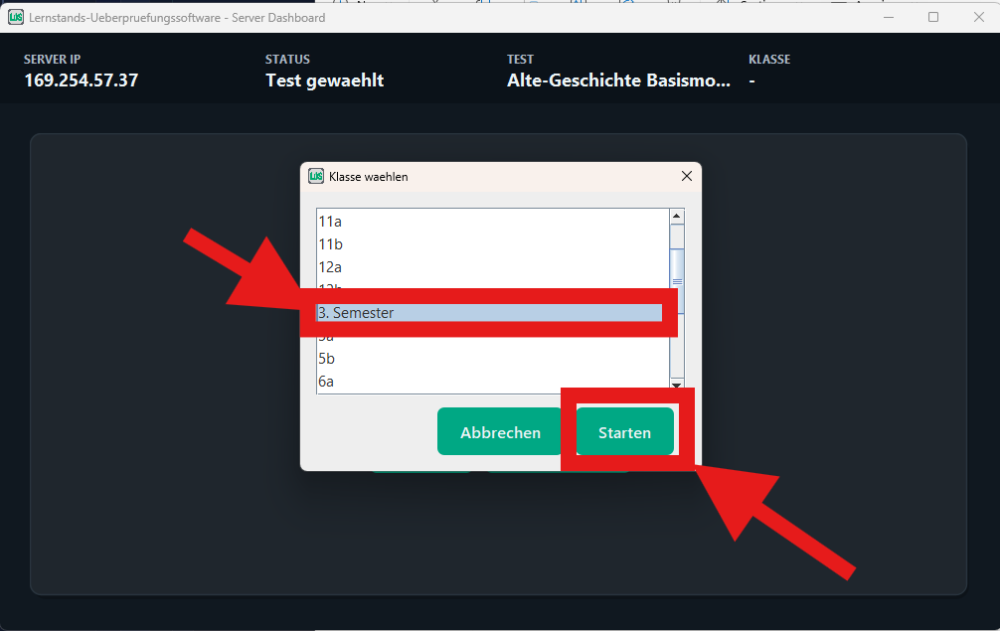
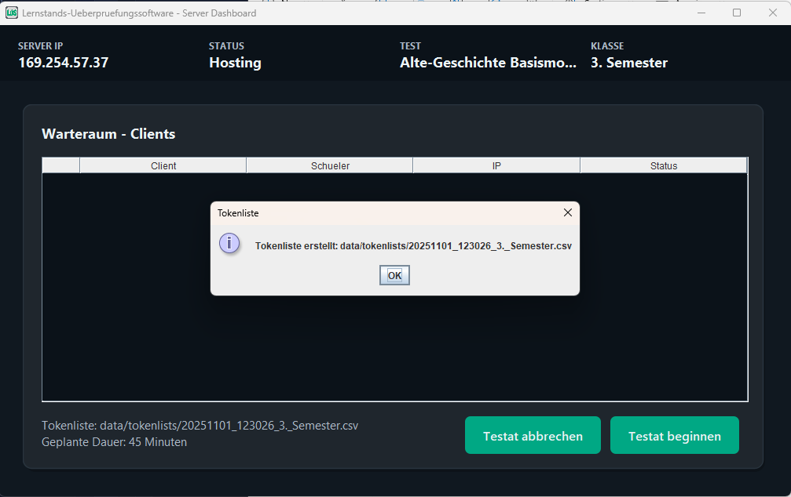
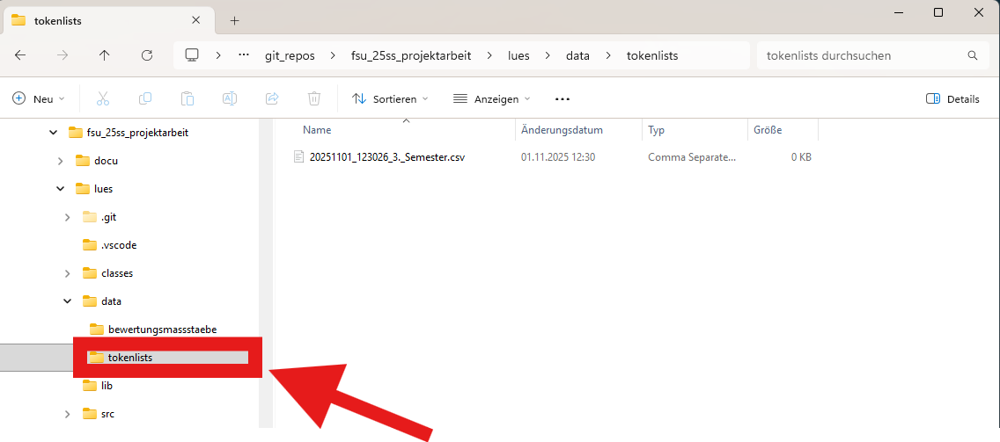
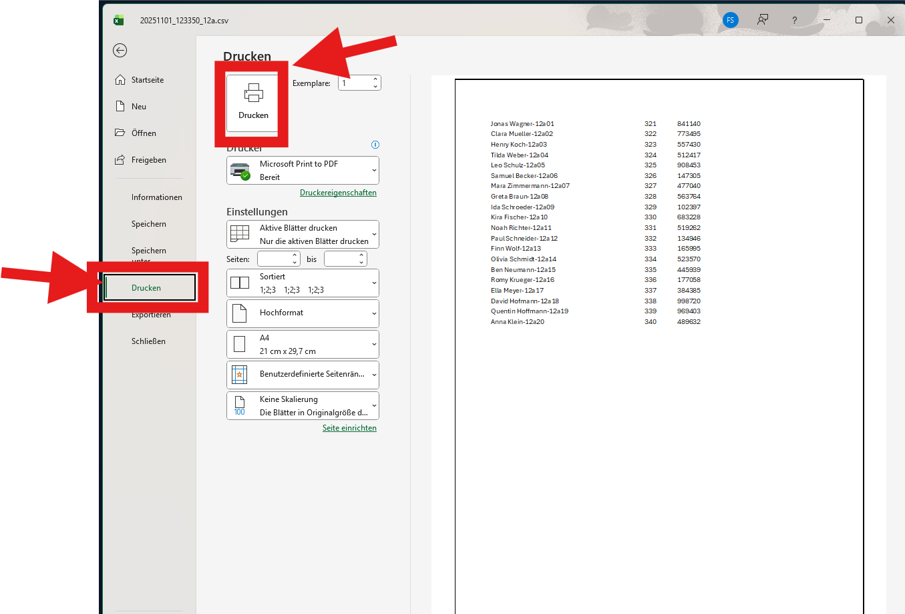 
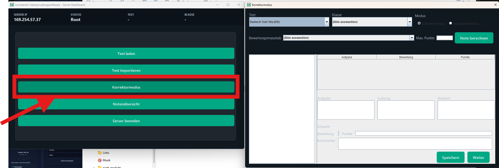
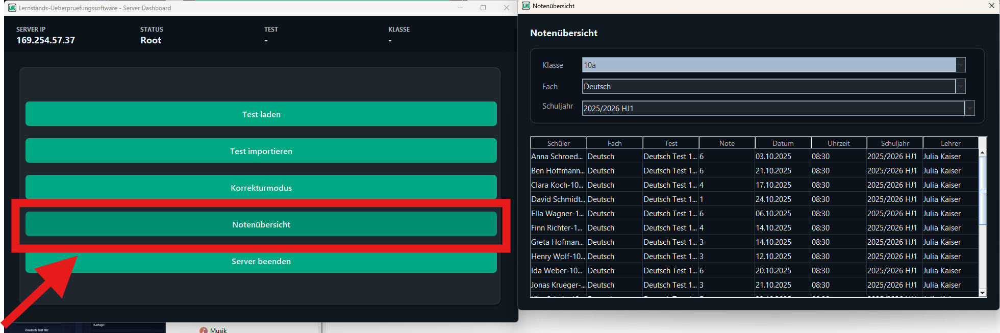

### 2.2 Client 

- Starten Sie die Client-Anwendung durch Doppelklick auf dei Datei ``quickstartClient.bat``
- alternativ: 
    - ``quickstartClient.bat``          -> startet die grafische Client-Anwendung<br />
    - ``quickstartClient.bat -nogui``    -> startet den Konsolen-Client<br />
    - ``quickstartClient.bat -help``    -> zeigt diese Hilfe direkt an.

### 2.3 Editor
- Öffnen Sie die Datei ``editor.html`` in ihrem Webbrowser
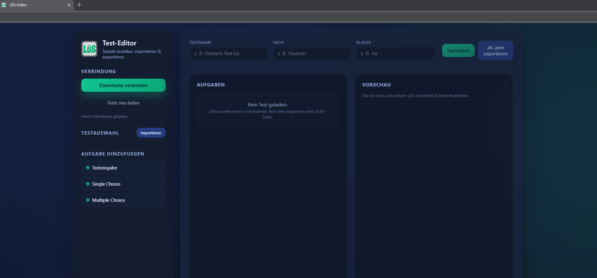

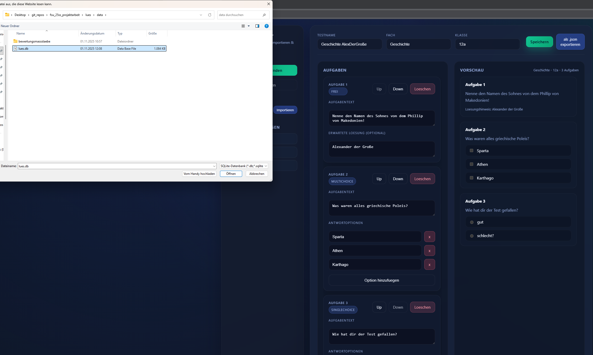
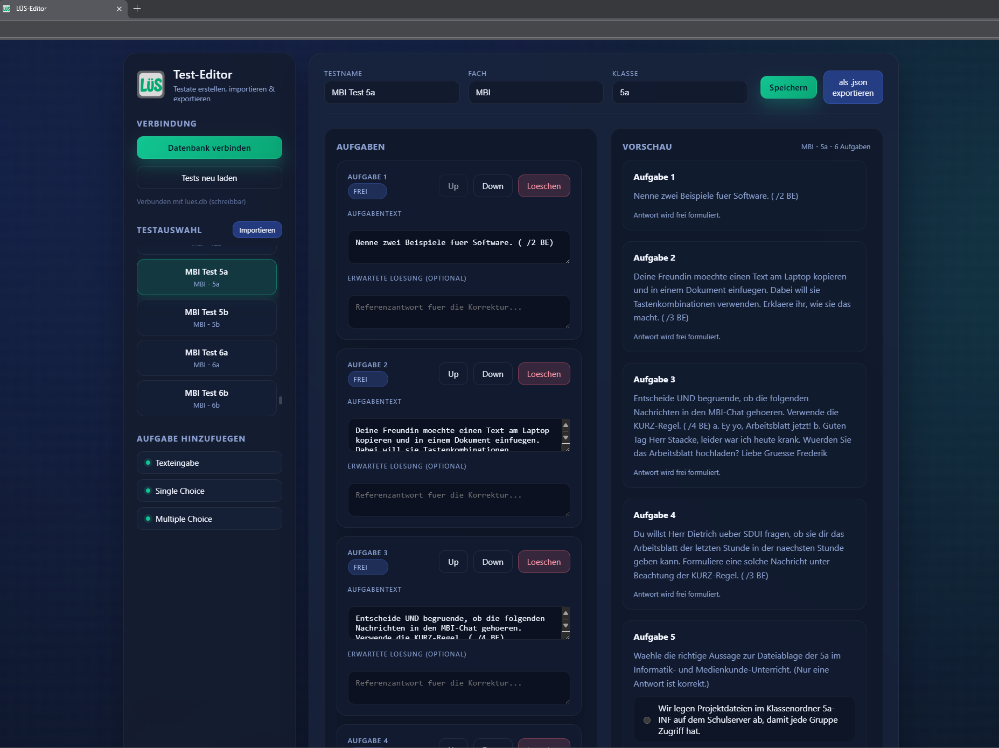

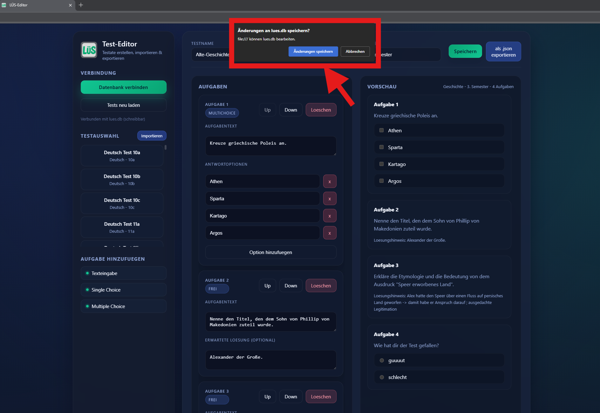
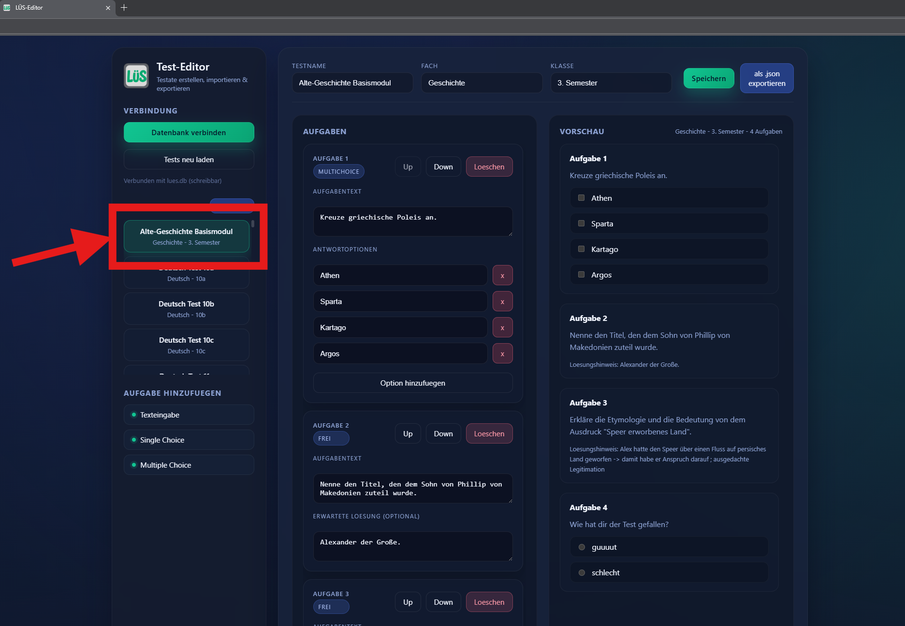


## 3. Entwicklerhinweise

[zum Entwicklerhandbuch](projectRessources/README.md)
### 3.1 Projektstruktur


```
.
├── classes
│   ├── backend
│   │   ├── client
│   │       └── ...
│   │   └── server
│   │       └── ...
│   ├── frontend
│   │   ├── client
│   │       └── ...
│   │   └── server
│   │       └── ...
│   └── sources.txt
├── data
│   ├── bewertungsmassstaebe
│   │   ├── sek1.csv
│   │   └── sek2.csv
│   ├── config.ini
│   ├── log.txt
│   ├── lues.db
│   └── tokenlists
│       ├── ...
├── dummy_setDB.bat
├── editor.html
├── .git
│   └── .....
├── .gitignore
├── lib
│   └── sqlite-jdbc-3.50.1.0.jar
├── quickstartClient.bat
├── quickstartServer.bat
├── README.md
├── src
│   ├── backend
│   │   ├── client
│   │   │   ├── Client.java
│   │   │   └── Message.java
│   │   └── server
│   │       ├── DatabaseHandler.java
│   │       ├── dummy_App.java
│   │       ├── LogfileHandler.java
│   │       ├── Message.java
│   │       └── Server.java
│   └── frontend
│       ├── client
│       │   ├── Button.java
│       │   ├── ClientMain.java
│       │   ├── Dekupel.java
│       │   ├── GridbagConstraints.java
│       │   ├── IClient.java
│       │   ├── Label.java
│       │   ├── NetworkClientBridge.java
│       │   ├── Nontupel.java
│       │   ├── Oktupel.java
│       │   ├── Panel.java
│       │   ├── Quadrupel.java
│       │   ├── Quintupel.java
│       │   ├── ScreenSize.java
│       │   ├── ScrollPane.java
│       │   ├── Sechstupel.java
│       │   ├── Septupel.java
│       │   ├── Table.java
│       │   ├── TextField.java
│       │   ├── Tripel.java
│       │   ├── Tupel.java
│       │   ├── UI.java
│       │   └── Window.java
│       ├── .gitkeep
│       └── server
│           ├── AccentButton.java
│           ├── BackendServerAdapter.java
│           ├── CorrectionDialog.java
│           ├── CorrectionService.java
│           ├── IServer.java
│           ├── PlaceholderTextField.java
│           ├── RoundedPanel.java
│           ├── ServerDashboardFrame.java
│           └── ServerTheme.java
└── .vscode
    └── settings.json

91 directories, 275 files

```


### 3.2 mögliche Erweiterungen:
- anstatt von dummy-Daten für den Server eine Realdaten-Import Schnittstelle schaffen 
- Einen Test-Editor schaffen, der die markdownähnliche Notation 
- eine hübschere GUI schaffen 
- weitere Aufgabenformate schaffen; z.B.: 
    - auf einem Bild Hotspots setzen
    - etwaigen (Pseudo-) Code schreiben lassen und auswerten 
    - ...
- Schnittstellen schaffen zu bisher in Schulen existierenden Anwendungen (SDUI, Schulmanager, etc.)
- Die DB auf ein seperates Gerät extrahieren -> dort ein Nutzerdatenamangement schaffen 


</div>