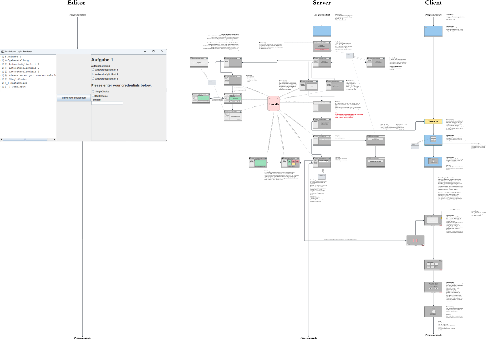
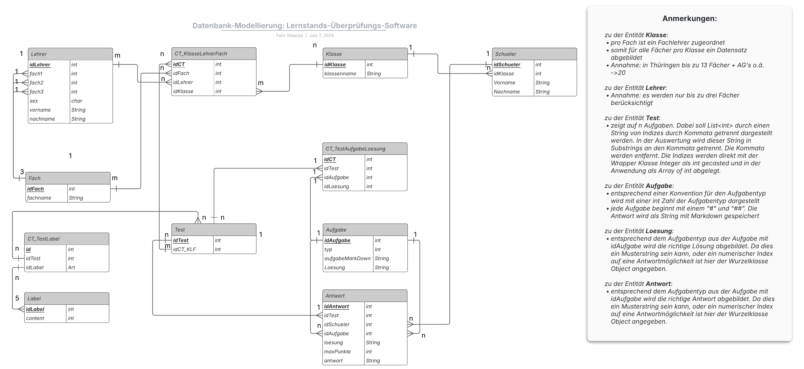
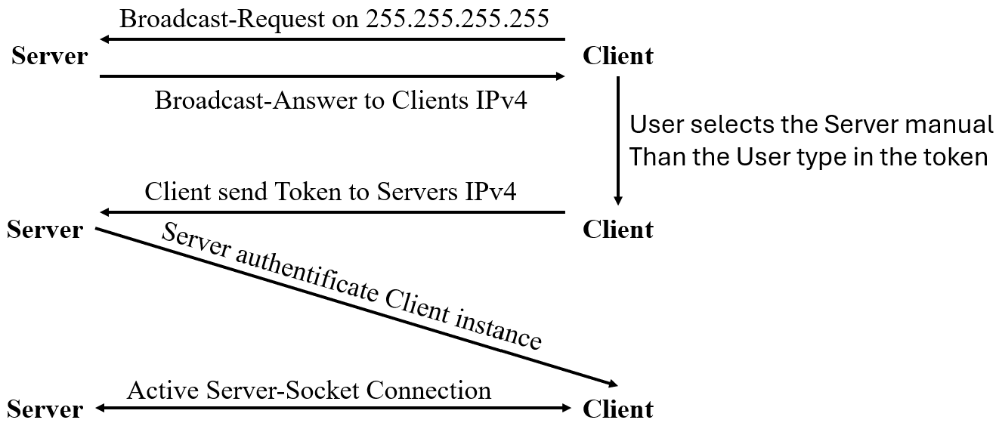

# Onboarding: Lernstand-Überprüfungs-Software (LÜS)

## Gliederung

1. [Über das Projekt](#1-über-das-projekt)  
2. [Organisatorisches](#2-organisatorisches)  
3. [Projektplanung](#3-projektplanung) 
   3.1 [Meetings](#31-meetings) 
   3.2 [GUI-Prozessplan](#32-gui-prozess-plan)  
   3.3 [Datenbank – ER-Diagramm](#33-datenbank--er-diagramm) 
   3.4 [API-Authentifikation](#34-api-authentifikation) 
   3.5 [Konvention Aufgabentyprepräsentation](#35-konvention-aufgabentyprepräsentation) 
   3.6 [Konvention Socketkommunikation](#36-socket-communication)
4. [Entwicklungsprozess](#4-entwicklungsprozess)  
5. [Mögliche Erweiterungen](#5-mögliche-erweiterungen)  

<!-- Bocksatz-->

## 1. Über das Projekt

<b>Motivation für das Konzept: </b> 

So wie in dem Modulkatalog festgehalten, soll die Projektarbeit schulische Bezüge herstellen. Wir beide studieren die Fächer Informatik und Geschichte im achten Fachsemester. Gerade aufgrund unserer informatischen Bildung sind wir sensibilisiert, unsere administrativen und geisteswissenschaftlichen Tätigkeiten durch smarte Software zu vereinfachen.  
Wir beide haben bereits das Praxissemester absolviert und konnten dabei in verschiedenen Bundesländern die aktuelle Belastung der Lehrkräfte beobachten. Angesichts dessen kam uns beiden die Überlegung, das Produkt dieses Moduls tatsächlich tätigkeitsorientiert zu gestalten.  
 
<b>Kurzbeschreibung</b> 
Timing is everything – gerade in dem Schulalltag. Mit der LÜS soll den nutzenden Lehrkräften da Zeit eingespart werden, wo dies bei einer digitalen Adaption ohne Verlust an pädagogischer Qualität möglich ist. Unsere LÜS soll das Auswerten von gedruckten bewerteten, oder unbewerteten Testaten ersetzen durch ein automatisiertes Auswerten der Schülerantworten. Dazu soll über den Lehrer-PC eine Software genutzt werden, die als Server in dem Klassenzimmer dient. Die Schüler wiederrum können auf den Schülerarbeitsplätzen mit den PC’s der Schule die Benutzeranwendung starten und mit der Lehreranwendung über das Netzwerk verbinden. Der 
Lehrer kann über die Lehreranwendung ein Event (=Testat) starten. Dabei werden vordefinierte Fragen (0, *) von der Lehreranwendung ausgelesen und verarbeitet. Von der Lehreranwendung werden nun an die verbundenen Schüleranwendungen einzeln Frage- 
und Antwortmöglichkeiten übermittelt und in der Schüleranwendung ansprechend dargestellt. Die Schüler können ihre Antworten in die GUI eingeben. Diese wird an den Server übermittelt und gespeichert. Nach Ende des Events, etwa durch Zeitablauf, oder durch manuelles Beenden der Lehrkraft, werden automatisch die Noten berechnet. 

## 2. Organisatorisches

|Name, Vorname| E-Mail | Studiengang | Fachsemester
|-|-|-|-|
Dietrich, Tobias| tobias.dietrich@uni-jena.de|Lehramt Gymnasium Informatik + Geschichte|8 (+1)|
Staacke, Felix| felix.staacke@uni-jena.de|Lehramt Gymnasium Informatik + Geschichte|8 (+1)|

## 3. Projektplanung

### 3.1 Meetings
Im Verlaufe des Semesters wurden wöchentliche Meetings zwischen Herrn Hohmuth, Herrn DIetrich und Herrn Staacke abgehalten. Dbaie wurden 

### 3.2 GUI-Prozess-Plan

**Abbildung:** *GUI-Prozessplan [^1]*

### 3.3 Datenbank - ER-Diagramm
Eine erste Hürde in dem Planungsprozess stellte die KOnzeption der Datenverwaltung dar. Anfangs gedachten Herr Dietrich und Herr Staacke, die Daten in einzlene Dateien zu verwalten und diese stets durch einen Handler auszulesen und zu schreiben. Nach mehrfachen Anraten und Problemen in der Implementierung adaptierten die beiden Studenten die Idee, eine [SQLite](https://sqlite.org/) Datenbank anzulegen. In der darauffolgenden Planung erstellten beide folgendes ``ER-Diagramm`` als Grundlage für die Implementierung. 

**Abbildung:** *ER-Diagramm [^2]*

Als kommunikative Klasse zwischen dem implementierten Server und der Datenbank-Datei dient die Klasse ``DatabaseHandler.java``. Diese liest aus der Datenbank und liefert Ergebnisse zu rück und koordiniert den schreibenden Zugriff. (``DatabaseHandler.java`` ist sozusagen das Datenbankmanagementsystem unseres Projektes).

**Anmerkung:** Die umgesetzte Datenbank arbeitet aktuell mit dummy Daten, die von der LLM [Codex](https://openai.com/de-DE/codex/) erzeugt wurden. Wenn sich das Repo installiert wird, dann muss diese Datenbank erstmal erzeugt werden und dummy-Daten eingegeben werden. Dazu wurde die Klasse ``src/backend/serverdummy_App.java`` erstellt, die mit dem Bash-Skript ``dummy_setDB.bat`` ausführbar ist. Diese Datei erstellt die Datenbankdatei ``data/lues.db`` und befüllt diese mit dummy-Daten.

### 3.4 API-Authentifikation

**Abbildung:** *API-Authentifikation [^3]*

Die Kommunikation zwischen ``src/backend/Server.java`` und ``src/backend/Client.java`` geschieht wie folgt:
- der ``src/backend/client/Client.java``-Instanzen fragen über die Netzwerkbasisadressen laufende ``src/backend/server/Server.java``-Instanzen an
- die laufende Server Instanz antwortet dann der IPv4 Adresse der anfragenden Client-Instanz
- alle geantworteten Server-Instanzen werden dann in der CLient UI in der Serverübersicht dargestellt
- Nach Serverauswahl und Tokeneingabe wird über die API-Klasse ``Message.java`` zuerst nur der Token übergeben; später wird mit genau dieser API-Klasse die Kommuniaktion übernommen (s. hierzu die Planung [Websocket-Protokoll](WebsocketProtocoll.md))

### 3.5 Konvention über interne Repräsentation
[zu der Konvention über die interne Aufgabentyprepräsentation](KonventionAufgabenTypen.md)

### 3.6 Socket Communication
[zu der Socket Kommunikations Planung](WebsocketProtocoll.md)

## 4. Entwicklungsprozess
es wurde in dem FSU internen Gitlab Ticket System gearbeitet
 

### 4.1 Entwicklungsschwerpunkt Felix
- Einbinden der SQLite Bibliothek in das Projekt
- DatabaseHandler als Schnittstelle zwischen Server und Datenbanksystem
- rudimentäre Aufsetzung Server und Client mit dem Ziel der Kommunikation über Sockets
- Broadcast-Anfrage an Server vom Client --> später vom Server zum Client nach Anmerkung von Herrn Hohmuth, sodass sich der Server über die Netzwerkbasisadresse offenbart
- nach Input von Herrn Hohmuth recherche nach API zwischen Server und Client --> um passgenau API anwenden zu können Erstellung der Klasse ``Message.java``
- Database und DatabaseHandler in den MainBranch gemerged
- in Konsole (serverseitig) konnte der Test in der Datenbank geladen werden und im Netzwerk gehostet werden --> in der Konsole des Clients konnten Aufgaben in textueller Form bereits angezeigt werden siehe hierzu Backup: Console only
- Implementierung Korrekturmodus --> kleinere Änderungen an der Tabellenstruktur nötig
- von Komilitonen (Felix Wiedemann) einen Test zur Verfügung stellen lassen (siehe hierzu Test 5a MBI)
- Dashboard, Warteraum, Notenübersicht und Korrekkturmodus UI mit KI erstellt (erstmal temporär) --> sollte durch graphische Oberfläche von Tobias Dietrich ersetzt werden
- Timer-Logik
- Editor-Logik
- Editor schnittstelle mittels JavaScript zur DB Datei ermöglichen

### 4.2 Entwicklungsschwerpunkt Tobias
- Einarbeitung in ``Java Swing``
- Erstellung der Anmeldemaske (Serverauswahl und Serveranmeldung) in Java Swing --> erste Idee Konfiguration (Größe, Layout, ...) der Elemente über Tupel (später verworfen zu unübersichtlich im Aufbau)
- erneute Erstellung der Anmeldemaske mit JavaSwing --> Konfiguration der einzelnen graphischen Elemente diesmal über innere Builder-Klassen (zu aufwendig und und immer noch unübersichtlich im Aufbau also später verworfen)
- Einarbeitung in ``JavaFX``
- Erstellung der graphischen Oberfläche mit JavaFX
- zuerst Erstellung der Anmeldemaske (Serverauswahl, Serveranmeldung)
- Erstellung des Warteraums
- Erstellung der graphischen Benutzeroberfläche in der die Aufgaben von den Schülern zu bearbeiten gewesen wären sowie Übersicht der Aufgaben vor der Abgabe
- Pausenansicht erstellt
- grundlegende Serveroberfläche designed

### 4.3 Konflikt bei der Hochzeit zwischen Backend und Frontend
- Arbeit mit zwei unterschiedlichen Java Versionen d.h. Teilprojekte nicht kompatibel (19.10.2025)
   - Problem 1: Tobias Dietrich konnte Code von Felix Staacke nicht reviewen
   - Problem 2: JavaFX Bibliothek, die Tobias Dietrich auf seiner Java Version (Java 11) verwendete, konnte auf Felix Staackes Java Version (Java 24) nicht eingebunden werden --> Problem konnte trotz offizieller Dokumentation nicht gelöst werden
- wegen Abgabefrist JavaFX-Code in Java-Swing-Code umnwandeln zu lassen (siehe Nachricht auf Element 22.10.2025)

### 4.4 Letzte Anpassungen
- Multiple und Single-Choice Aufgaben als Aufgabentyp mit hinzufügen
- kleine Anpassungen in der graphischen Benutzeroberfläche der Clients
- Vervollständigung der Dokumentation

## 5. Mögliche Erweiterungen
- Editor-Modus für Server
- die Aufgaben-Konvention ergänzen, um weitere, fachspezifischere Aufgabenformate zu implementieren
- dazu ggf. eine Schnittestelle implementieren, damit dies möglich ist

[^1]: In der Umsetzung wurden Änderungen  vorgenommen. So etwa entfällt in der Client Anmeldemaske das Eingabenfeld der IPv4 Adresse.
[^2]: Die Umsetzung nutzt eine SQLite-Datenbank. Voraussetzung dafür ist ein JDBC-Treiber. Als Datanbankmanagement-System wurde der DBHandler implementiert.
[^3]: Die Umsetzung nutzt eine API-Authentifikation. Die API-Authentifikation wird durch eine API-Authentifikationsanfrage durchgeführt. Die API-Authentifikationsanfrage wird durch eine API-Authentifikationsantwort durchgeführt.